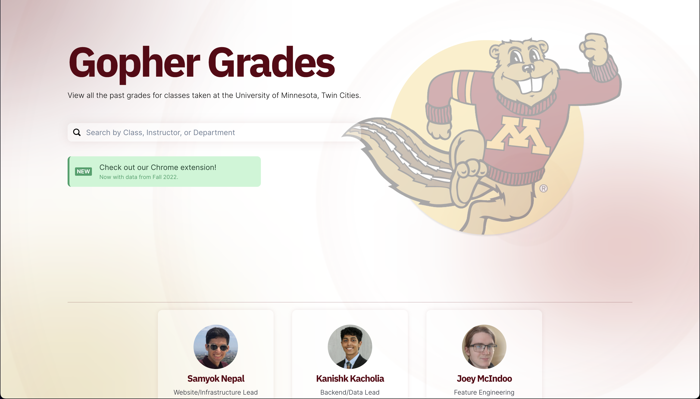

[](https://umn.lol)
# GopherGrades v2!

GopherGrades is a web app that allows you to look up past grades for courses at the University of Minnesota. The frontend is built with NextJS, SQLite, and ChakraUI. The backend is written in Python utilizing the pandas library to wrangle data provided to us by the [Office of Data Access and Privacy](https://ogc.umn.edu/data-access-and-privacy) and [The Office of Undergraduate Education Academic Support Resources](https://github.com/umn-asr/courses).


# Running Locally
```bash
cd frontend

# make sure you have nodejs, npm, and yarn installed!
yarn install

yarn dev
# live at http://localhost:3000
```

# Building the Firefox Extension

```bash
cp chrome-extension firefox-extension
rm firefox-extension/manifest.json
node bin/manifet.json 